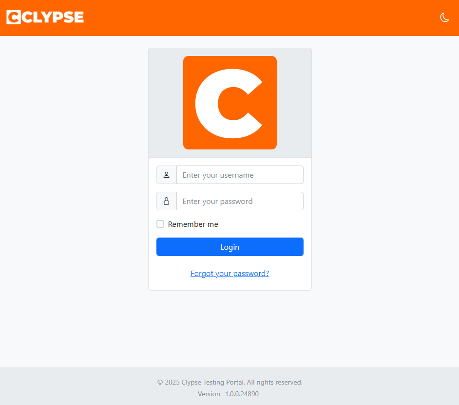
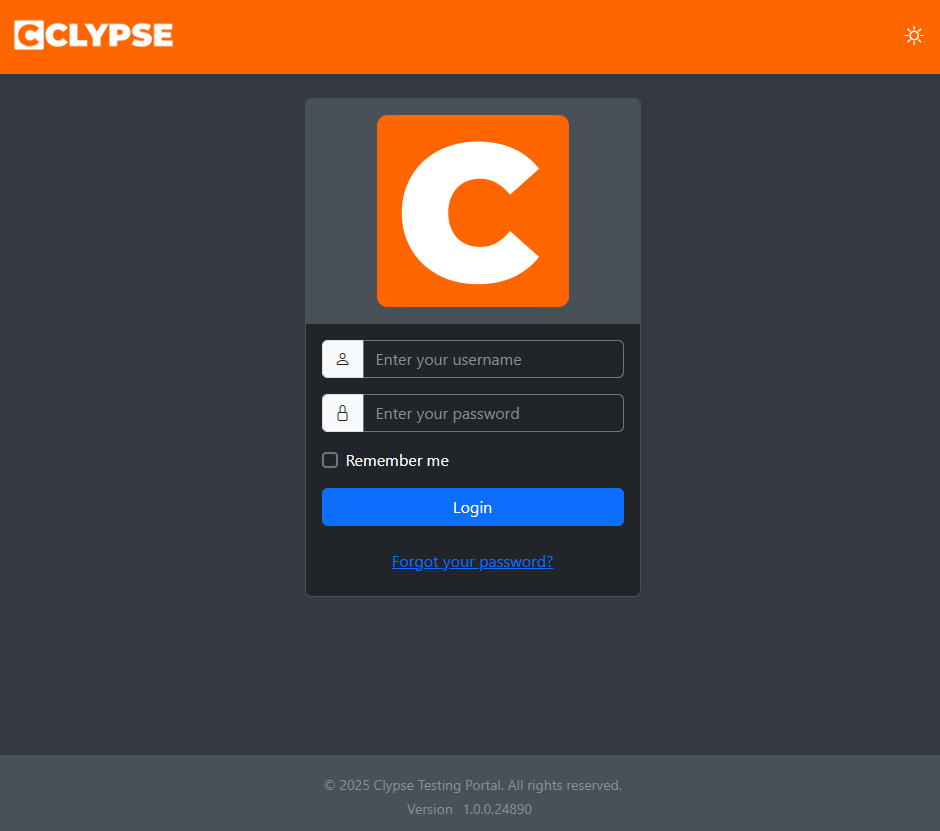
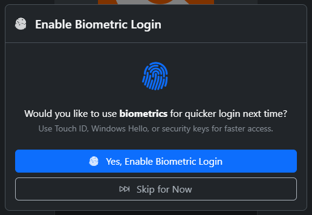
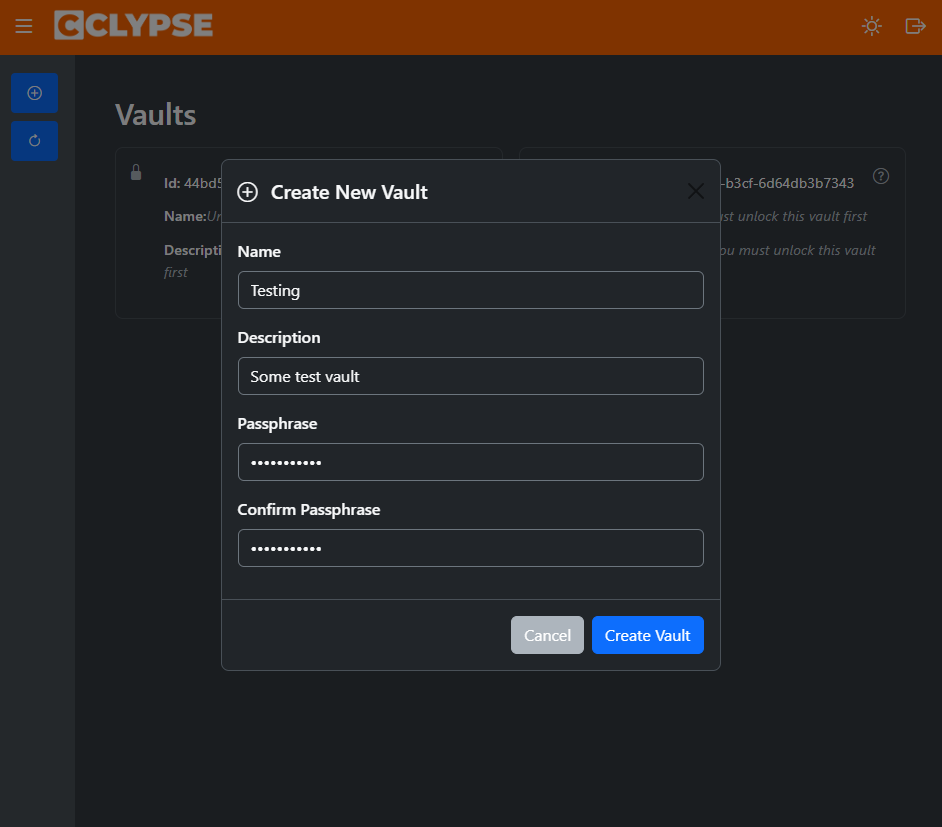
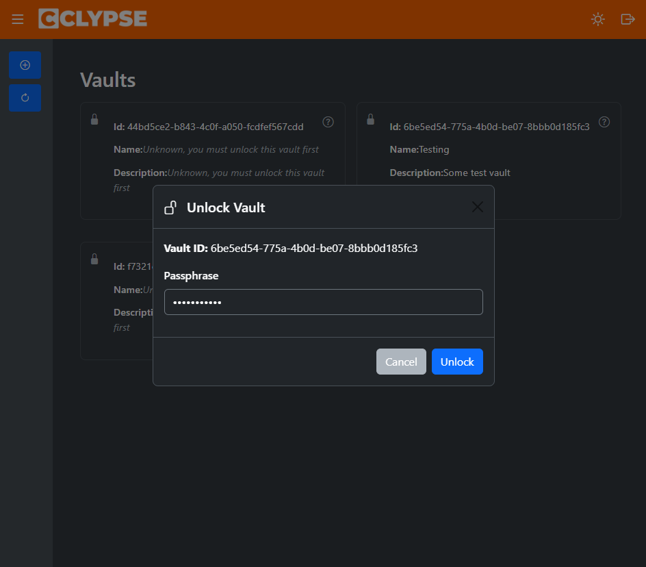
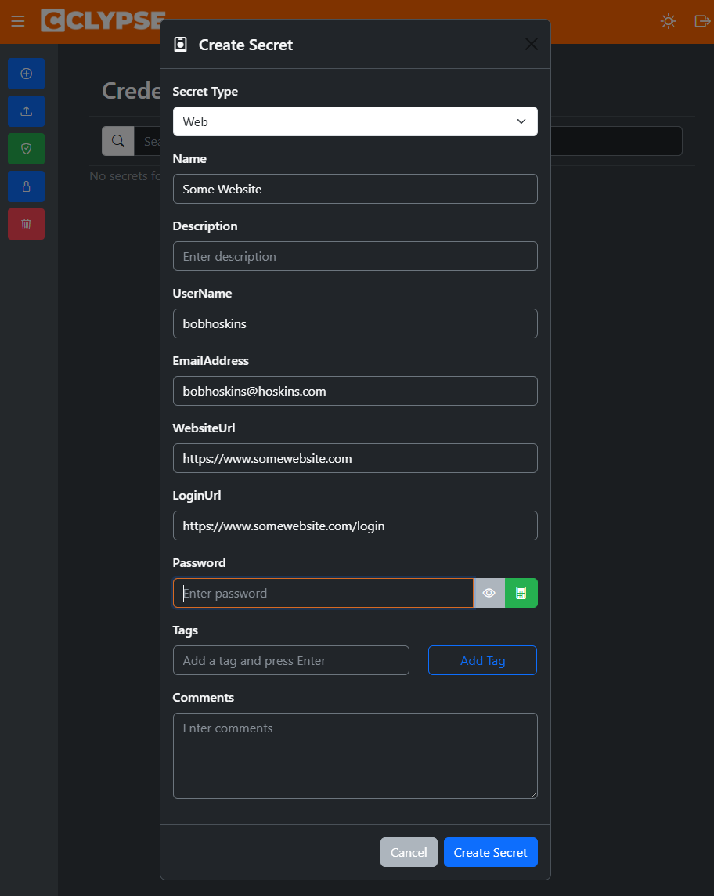
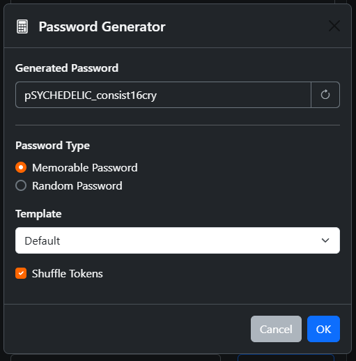
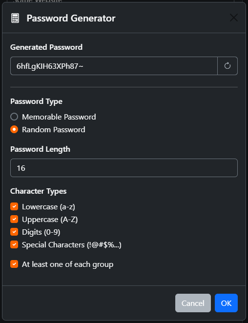
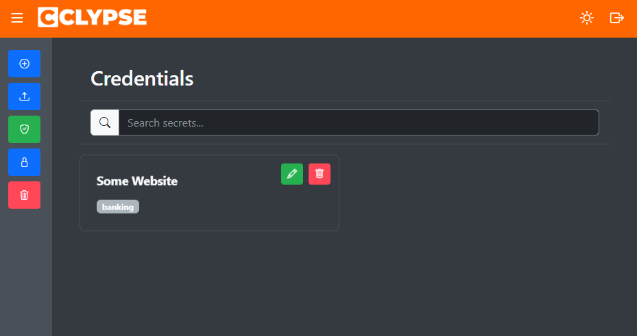
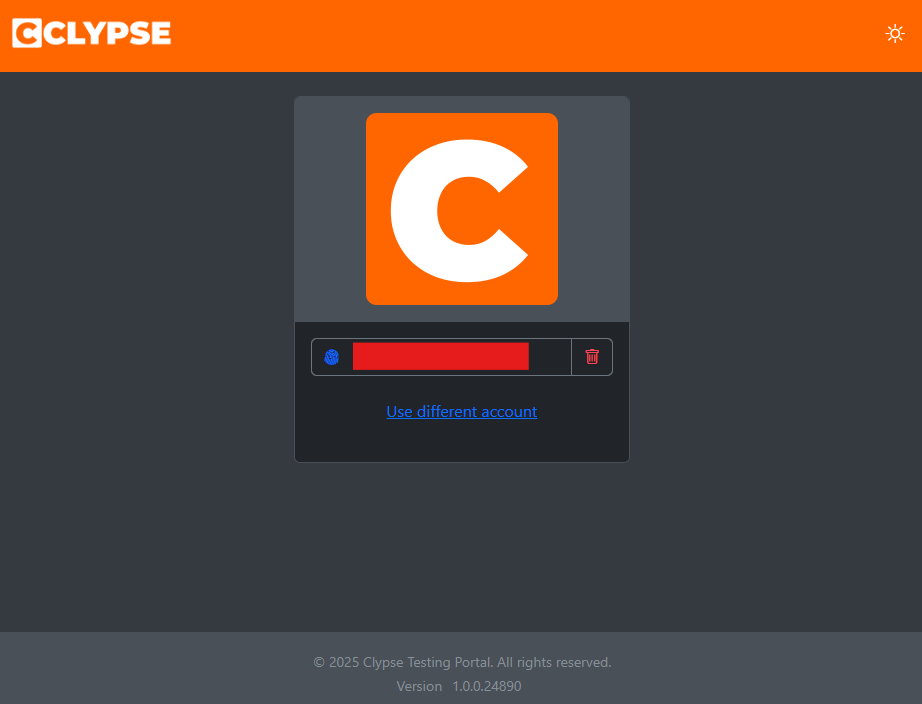

[](https://github.com/devoctomy/clypse/actions/workflows/tests.yml)
[](https://codecov.io/gh/devoctomy/clypse)
[](https://app.codacy.com/gh/devoctomy/clypse/dashboard?utm_source=gh&utm_medium=referral&utm_content=&utm_campaign=Badge_grade)
[](https://app.codacy.com/gh/devoctomy/clypse/dashboard?utm_source=gh&utm_medium=referral&utm_content=&utm_campaign=Badge_coverage)

> AI has been used in the generation of some parts of this application. This includes the portal code and a large number of bulk unit tests. The underlying core library which handles the cyrptographic operations as well as S3 file management has been written by myself. The portal code is pretty messy and not yet adequately covered by tests. This application is also not yet ready for production, so use at your own risk.

# clypse

Clypse, is a complete password management system that you host yourself in Amazon S3. Completely serverless, hosted as a static website with some additional Cognito configuration for user management. Super easy, and super cheap.

It is designed to use the latest cryptographic standards but also be highly customisable.

## Setup & Deployment

Clypse includes an automated setup application (`clypse.portal.setup`) that handles all AWS resource creation and deployment. Simply run this application from Visual Studio to set up your complete password management system.

### AWS Resources

When deployed to AWS, Clypse requires the following AWS resources (all pay-as-you-go with minimal costs):

* 🪣 **2 x S3 Buckets**
  - Portal hosting bucket (static website)
  - User data bucket (individual user folders with scoped access)
* 👥 **Cognito Identity Pool** - Provides temporary AWS credentials for authenticated users
* 👤 **Cognito User Pool** - User authentication and management
* 🛂 **2 x IAM Policies**
  - Authenticated user policy (scoped S3 access to user's folder)
  - Internal Cognito service policy
* 🎖️ **IAM Role** - Assigned to authenticated users for S3 access
* ☁️ **CloudFront Distribution** - HTTPS access to the portal with caching

### Running the Setup Application

1. Open the solution in Visual Studio
2. Set `clypse.portal.setup` as the startup project
3. Run the application - it will present an interactive menu
4. The setup tool will prompt you for the following parameters:
   - **AWS Access Key ID** - Your AWS credentials
   - **AWS Secret Access Key** - Your AWS credentials
   - **AWS Region** - Where resources will be created (e.g., `us-east-1`)
   - **Resource Prefix** - Prefix for all AWS resource names (e.g., `my-clypse`)
   - **Portal Build Output Path** - Path to the published WASM build, this will be set automatically if you do the build within the setup tool.
   - **Initial User Email** - Email for the first Cognito user account

The setup application will automatically create all required AWS resources, configure permissions, and deploy the portal. All configuration is managed through an interactive menu.

## Testing

### Unit Testing

You can simply run the unit tests from within Visual Studio or use the following command from the project root,

```
dotnet test clypse.core.UnitTests --no-build --configuration Release --verbosity normal --logger trx --results-directory ./TestResults/UnitTests
```

### Integration Testing

Integration testing requires the following environment variables

* CLYPSE_INTTEST_AWS_BUCKETREGION - Region of the test bucket
* CLYPSE_INTTEST_AWS_BUCKETNAME - Test bucket name
* CLYPSE_INTTEST_AWS_ACCESSKEY - IAM credentials for accessing the s3 bucket
* CLYPSE_INTTEST_AWS_SECRETACCESSKEY - IAM credentials for accessing the s3 bucket

The integration tests test the underlying core framework, integrating with AWS S3, without any UI. The tests will create a vault, with a number of secrets and then clean up after itself.

> The integration tests do not test any part of Aws Cognito integration. This is done with the UI tests.

### UI Tests

UI Tests are done by Playwright which should be installed prior to running.

https://playwright.dev/dotnet/docs/intro

Basically the PlayWright package adds a PowerShell script to the bin output folder, this is what you use in Windows to install Playwright and the necessary browsers. You will also require the following environment variables,

* CLYPSE_UITESTS_USERNAME - Aws Cognito username for the test user
* CLYPSE_UITESTS_PASSWORD - Aws Cognito password for the test user

### Manual Testing

You can either simply press play in Visual Studio, which should launch the portal in Debug build on port 7153, or you can perform the full WASM build which is *much* faster and is what gets published to production. The Debug build also has certain features cranked down in order to improve performance merely during running simple tests,

1. The default cryptographic Argon2id key derivation parameters are set to 64mb. This is still slow, but adequate for testing.
2. Weak password list is hardcoded to a single entry, as JS <-> C# interop is extremely slow when not running the full WASM build.

The easiest way serve the full WASM build locally you can use the dotnet-serve tool. To install it run the following command,

```
dotnet tool install -g dotnet-serve
```

Then run the following to publish the build locally and serve it over SSL.

```
dotnet tool install -g dotnet-serve
dotnet publish ./clypse.portal/clypse.portal.csproj -c Release -r browser-wasm --self-contained
dotnet serve -d ./clypse.portal/bin/Release/net10.0/publish/wwwroot -p 7153 --tls
```

> You must have CORS configured for the S3 bucket for 'https://localhost:7153' otherwise all requests to S3 will fail.

## GitHub Workflows

The project uses a comprehensive CI/CD pipeline that runs automated tests and deploys to production after approval and successful Tests workflow run.

### Workflow Overview

The Tests workflow (`tests.yml`) consists of 3 sequential jobs:

#### 1. Unit Tests
- **Purpose**: Validates core library functionality without external dependencies
- **Environment**: Ubuntu container with Playwright for .NET
- **Steps**:
  - Installs Python (required for WASM build tools)
  - Sets up .NET 10.0 SDK
  - Configures HTTPS development certificates
  - Installs WASM tools workload
  - Restores dependencies and builds the project
  - Runs unit tests from `clypse.core.UnitTests`
  - Uploads test results as artifacts
  - Uploads code coverage report to Codecov
- **Required Secrets**: None

#### 2. Integration Tests
- **Purpose**: Tests AWS S3 storage integration using the core library
- **Environment**: Ubuntu container with Playwright for .NET
- **Steps**:
  - Same setup as unit tests
  - Runs integration tests from `clypse.core.IntTests` with AWS credentials
  - Tests vault creation and secret management against a real S3 bucket
  - Uploads test results as artifacts
- **Required Secrets**:
  - `CLYPSE_INTTEST_AWS_BUCKETREGION`     - AWS region for test bucket
  - `CLYPSE_INTTEST_AWS_BUCKETNAME`       - Name of the S3 test bucket
  - `CLYPSE_INTTEST_AWS_ACCESSKEY`        - IAM access key with S3 permissions
  - `CLYPSE_INTTEST_AWS_SECRETACCESSKEY`  - IAM secret access key

#### 3. UI Tests
- **Purpose**: End-to-end testing of the Blazor portal including AWS Cognito authentication
- **Environment**: Ubuntu container with Playwright browsers
- **Steps**:
  - Same setup as previous jobs
  - **Updates `appsettings.json` with production configuration from secrets**
  - Runs Playwright-based UI tests from `clypse.portal.UITests`
  - Tests user authentication and vault management workflows
  - Uploads test results as artifacts
- **Required Secrets**:
  - `CLYPSE_UITESTS_USERNAME`             - AWS Cognito test user username
  - `CLYPSE_UITESTS_PASSWORD`             - AWS Cognito test user password
  - `CLYPSE_UITESTS_PORTAL_APPSETTINGS`   - Complete JSON configuration for the portal

#### Required GitHub Secrets Summary

To run the Tests pipeline, configure the following secrets in your GitHub repository settings:

- `CLYPSE_INTTEST_AWS_BUCKETREGION`              - AWS region for test bucket
- `CLYPSE_INTTEST_AWS_BUCKETNAME`                - Name of the S3 test bucket
- `CLYPSE_INTTEST_AWS_ACCESSKEY`                 - IAM access key with S3 permissions
- `CLYPSE_INTTEST_AWS_SECRETACCESSKEY`           - IAM secret access key
- `CLYPSE_UITESTS_USERNAME`                      - AWS Cognito test user username
- `CLYPSE_UITESTS_PASSWORD`                      - AWS Cognito test user password
- `CLYPSE_UITESTS_PORTAL_APPSETTINGS`            - Complete JSON configuration for the portal 
  
The Deploy workflow (`deploy.yml`) consists of 1 job:

#### 1. Deploy
- **Purpose**: Publishes the Blazor WebAssembly app to AWS S3 and invalidates CloudFront cache
- **Trigger**: Only runs when manually triggered with the `deploy` input set to `true`
- **Environment**: Ubuntu latest
- **Steps**:
  - Sets up .NET 10.0 SDK and WASM tools
  - Restores dependencies
  - **Updates `appsettings.json` with production configuration from secrets**
  - Publishes Blazor WebAssembly in Release mode
  - Configures AWS credentials
  - Syncs published files to S3 bucket with public-read ACL
  - Invalidates CloudFront distribution to refresh cached content
- **Required Secrets**:
  - `CLYPSE_PUBLISH_AWS_BUCKETREGION`              - AWS region for production bucket
  - `CLYPSE_PUBLISH_AWS_BUCKETNAME`                - Production S3 bucket name
  - `CLYPSE_PUBLISH_AWS_ACCESSKEY`                 - AWS access key for deployment
  - `CLYPSE_PUBLISH_AWS_SECRETACCESSKEY`           - AWS secret access key for deployment
  - `CLYPSE_PUBLISH_AWS_CLOUDFRONTDISTRIBUTIONID`  - CloudFront distribution ID for cache invalidation
  - `CLYPSE_PUBLISH_APPSETTINGS`                   - Complete JSON configuration for the portal

#### Required GitHub Secrets Summary

To run the Deploy pipeline, configure the following secrets in your GitHub repository settings:

- `CLYPSE_PUBLISH_AWS_BUCKETREGION`              - AWS region for production bucket
- `CLYPSE_PUBLISH_AWS_BUCKETNAME`                - Production S3 bucket name
- `CLYPSE_PUBLISH_AWS_ACCESSKEY`                 - AWS access key for deployment
- `CLYPSE_PUBLISH_AWS_SECRETACCESSKEY`           - AWS secret access key for deployment
- `CLYPSE_PUBLISH_AWS_CLOUDFRONTDISTRIBUTIONID`  - CloudFront distribution ID for cache invalidation
- `CLYPSE_PUBLISH_APPSETTINGS`                   - Complete JSON configuration for the portal

### Workflow Execution

- **tests.yml � Unit Tests**: Runs automatically on every push, pull request, or manual dispatch; this is the first job and it must succeed before anything else can execute.
- **tests.yml � Integration Tests**: Starts only after `unit-tests` succeeds and only for first-party branches (forked PRs are skipped); gated on the AWS integration secrets being available.
- **tests.yml � UI Tests**: Queues after `integration-tests` completes successfully, reuses the same runner image, and requires the Cognito credentials plus portal appsettings secret before it can run.
- **deploy.yml � Production Deploy**: Auto-triggers when the Tests workflow finishes successfully on `main` (push or manual rerun), targets the protected `production` environment, and will not start publishing to AWS until a maintainer approves the environment gate.

## Screenshots




















